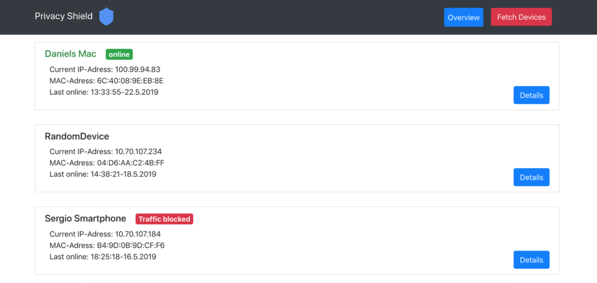
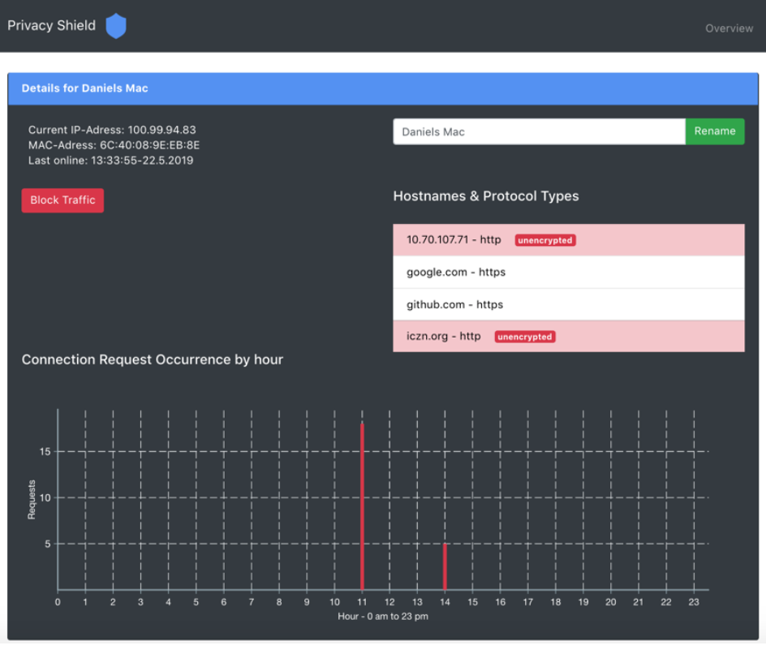

# PrivacyShield 🛡
The idea of the privacy shield is to provide smart home owners with an interface to control their IoT devices.
This interface should enable users to examine the traffic leaving the administrative domain and filter or obscure it based on protection classes.
The prototype of the Privacy Shield runs on a raspberry pi 3.
The pi is setup as a network bridge between the router and the IoT devices. 
A webserver with an React web application runs on the pi.
The prototypes features include traffic analyzation and device blocking. 

## Architecture

## Screenshots

## Quickstart
- modify Proxy: client/package.json to your IP-address
- Running Node-Server and React Frontend: `npm run dev`
- Running Node-Server, React Frontend, Traffic Analyzer: `npm run all-dev`

## Useful Commands and Tools
### Restart DHCPCD client
`sudo systemctl restart dhcpcd`

### Remote Development
- https://code.visualstudio.com/docs/remote/ssh

### Installation of sqlite3
Install sqlite3: https://github.com/converge/instapy-dashboard/issues/19

### Iptables, Blacklisting-Approach
- `sudo modeprobe br_netfilter` to enable iptables (netfilter) on bridge interface
- Setup Rule for MAC: `sudo iptables -A FORWARD -m mac --mac-source XX:XX:XX:XX:XX:XX -j DROP`
- Delete Rule for MAC: `sudo iptables -D FORWARD -m mac --mac-source XX:XX:XX:XX:XX:XX -j DROP`

